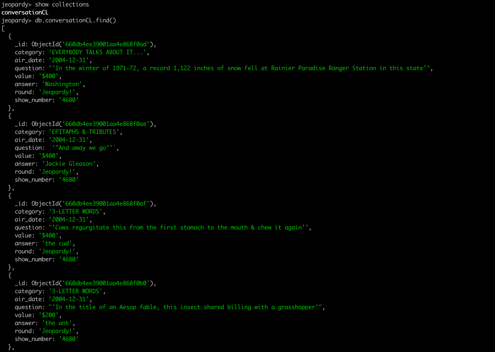
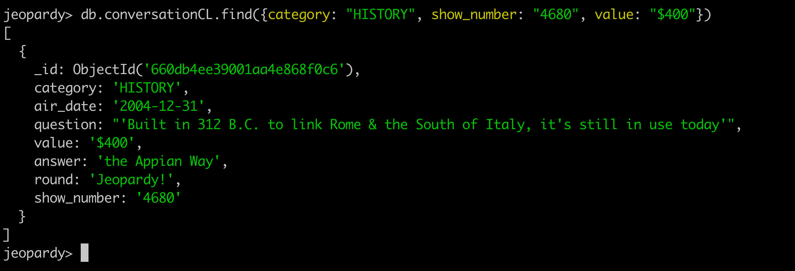
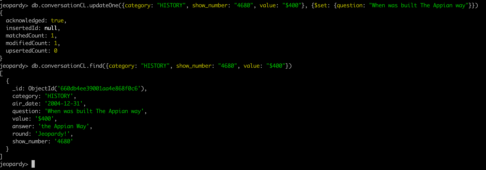
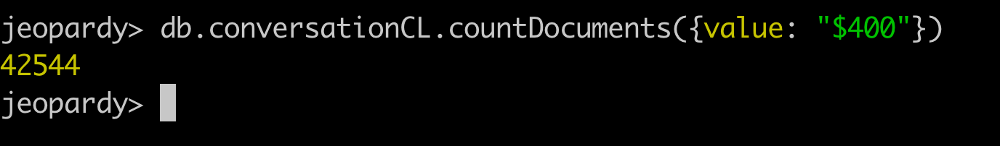
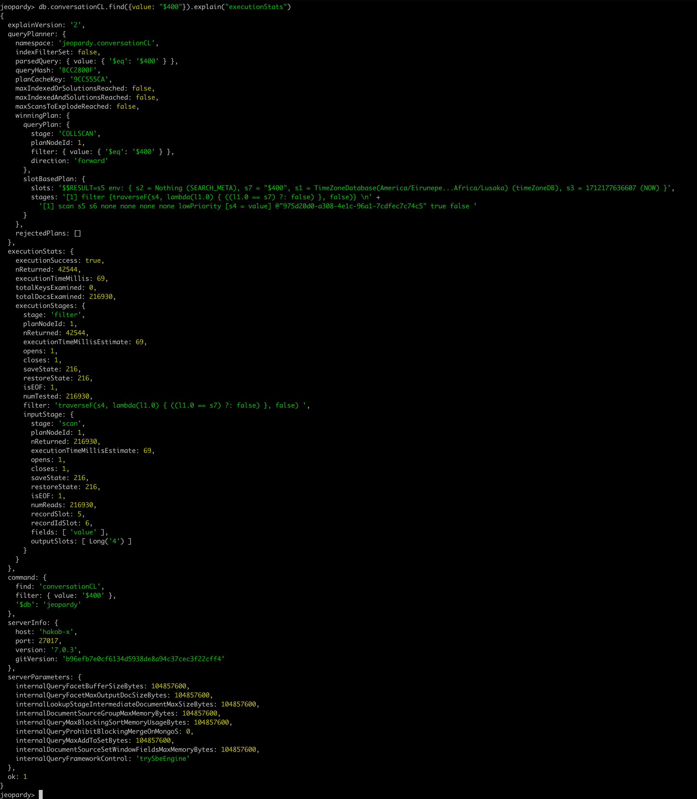
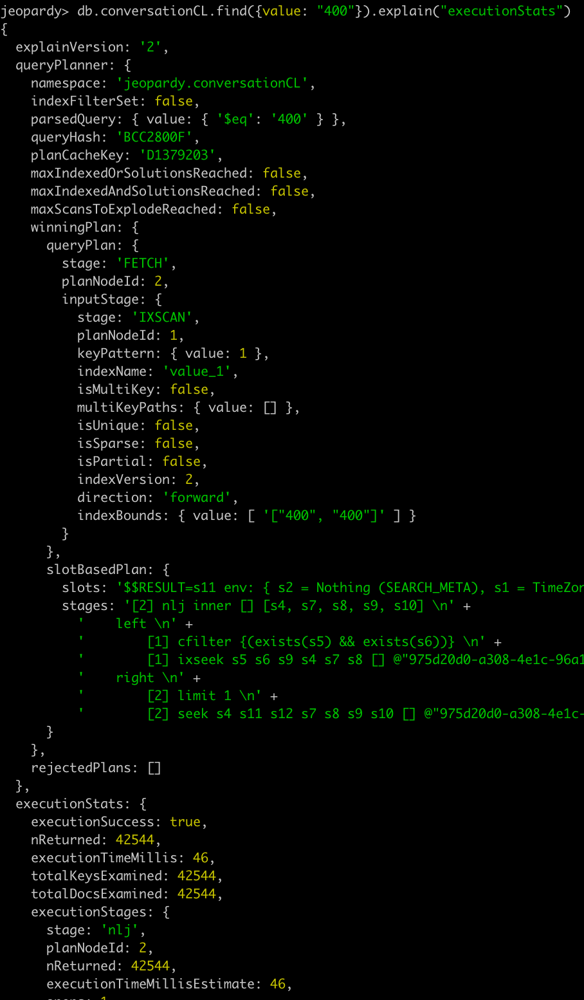

## Task 2 practice with MongoDB

Installed MongoDB on my MacOS 
- `brew install mongodb`

Run it in a separate shell with local path to empty data directory
- `/Applications/MongoDB.app/Contents/MacOS/MongoDB --dbpath /Users/hakob/Desktop/Mipt/DB-course-tasks/Task2MongoDBPractice/data/db`

Install mongo-shell by this command and run mongosh
- `brew install mongosh`, `mongosh`

Using command `show dbs`, we look at existing data-bases
Use command `use jeopardy` to create a data-base with name "jeopardy" or to connect to it

Install mongodb tools using
- `brew install mongodb-database-tools`

Run mongoimport command to import downloaded dataset
- `mongoimport --db jeopardy --collection conversationCL --file /Users/hakob/Downloads/JEOPARDY_QUESTIONS1.json --jsonArray`

After successfully importing dataset, run in mongoshell
- `db.conversationCL.find()`

As you can see here is our data

Next we will look for data with "category: 'HISTORY'", "show_number: '4680'" and "value: '$400'"
- `db.conversationCL.find({category: "HISTORY", show_number: "4680", value: "$400"})`

We get exactly one record

Let's alter that record changing the question
- `db.conversationCL.updateOne({category: "HISTORY", show_number: "4680", value: "$400"}, {$set: {question: "When was built The Appian way"}})`

Now let's alter all records with some categories, setting their value to "$400", and get the count of all records with "value: '$400'"
- `db.conversationCL.updateMany({category: "HISTORY"}, {$set: {value: "$400"}})`
- `db.conversationCL.updateMany({category: "MUSICAL TRAINS"}, {$set: {value: "$400"}})`
- `db.conversationCL.updateMany({category: "THAT OLD-TIME RELIGION"}, {$set: {value: "$400"}})`
- `db.conversationCL.find({value: "$400"}).count()`

Next we get the time, which is spent on read operation of that records
`db.conversationCL.find({value: "$400"}).explain("executionStats")`

From the bunch of output we need the field "executionTimeMillisEstimate: ", and here we have number __69__ without using any "Index"

Build "Index" using field "value", with ascending order, and check the execution time
- `db.conversationCL.createIndex({value: 1})`
- `db.conversationCL.find({value: "$400"}).explain("executionStats")

And we see that the new "executionTimeMillisEstimate" is __46__ which is, better than __69__

#### Conclusion
Even on a small dataset with only 46000 records Index gives a huge efficiency boost

---
