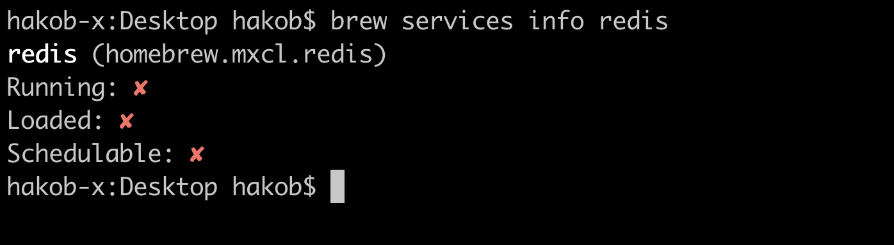
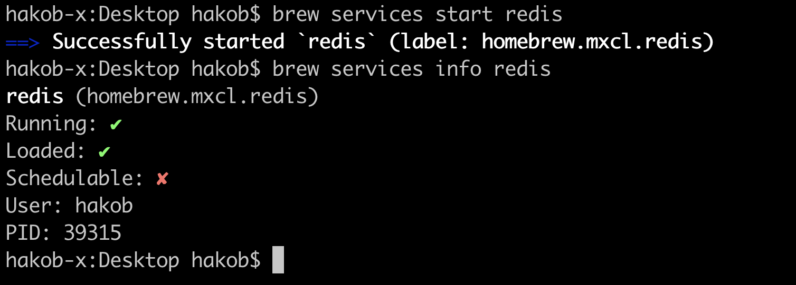
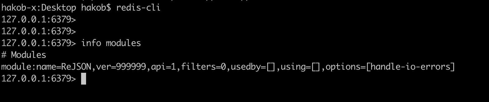
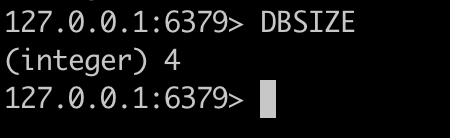
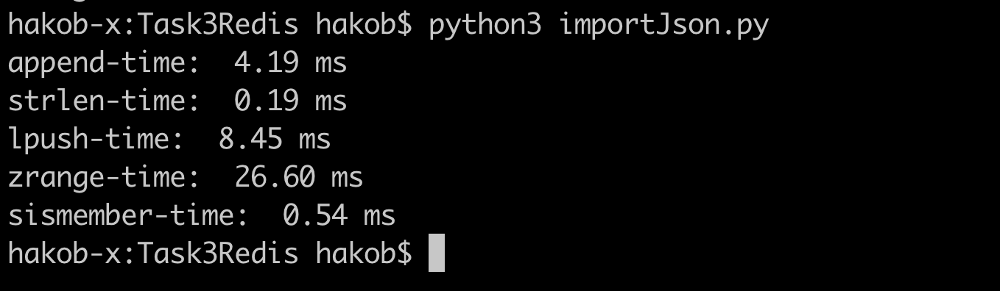

## Task 3 practice with Redis

Install redis on MacOS
- `brew install redis`

Look at current status using brew service command
- `brew services info redis`



Run redis and check new status
- `brew services start redis`
- `brew services info redis`



Stop redis service
- `brew services stop redis`

In order to install RedisJson module do next steps
- `curl --proto '=https' --tlsv1.2 -sSf https://sh.rustup.rs | sh` - install rustc compiler with cargo build tool

Close current shell and open new session in order to reaload available paths from PATH var
- `git clone https://github.com/RedisJSON/RedisJSON.git`
- `cd RedisJSON`
- `cargo build --release && cargo test`

Reload shell and start redis server in directory RedisJSON
`redis-server --loadmodule ./target/release/librejson.dylib`

In other shell window open redis client
`redis-cli`

In redis client shell run to ensure RedisJSON module running
`info modules`



Install redis package for python3
`pip3 install redis --break-system-packages`

We can check DB size using DBSIZE command in redis-client

Then we can run python scriot, store some data in DB
We will use the json file from Mongo hometask

```
import json
import numpy as np
import redis
import sys

str_data = open('./JEOPARDY_QUESTIONS1.json', 'r').read()
json_data = json.load(open('./JEOPARDY_QUESTIONS1.json'))

redis_client = redis.Redis(host='localhost', port=6379, db=0)

# insert one big str
redis_client.set('str_data', str_data)

# insert list 
list_data = str_data.split(',')
BATCH_SIZE = 1000
for i in range(0, len(list_data), BATCH_SIZE):
    redis_client.rpush('list_data', *list_data[i : i + BATCH_SIZE])

# insert set
set_data = {s for s in list_data}
# redis_client.sadd('set_data', *set_data)


floats = np.linspace(-5000, 5000, 500000)
floats_data = {str(f) : f for f in floats}
redis_client.zadd('floats_data', floats_data)

# should print 4
print(redis_client.dbsize())
```

Run `DBSIZE` in redis-client


Now run another script, to check some operations execution time

```
from time import time

start = time()
res = redis_client.append('str_data', 'NewSuffixOfSomeVeryLongStr')
finish = time()
print(f'append-time: {(finish - start) * 1000: .2f} ms')

start = time()
res = redis_client.strlen('str_data')
finish = time()
print(f'strlen-time: {(finish - start) * 1000: .2f} ms')

start = time()
res = redis_client.lpush('list_data', *list_data[:10000])
finish = time()
print(f'lpush-time: {(finish - start) * 1000: .2f} ms')

start = time()
res = redis_client.zrange('floats_data', 0, 50000)
finish = time()
print(f'zrange-time: {(finish - start) * 1000: .2f} ms')

start = time()
res = redis_client.sismember('set_data', 'HISTORY')
finish = time()
print(f'sismember-time: {(finish - start) * 1000: .2f} ms')
```


#### Conclusion

- All operations executed very fast if we compare with Postgres or Mongo. It is expected as Redis is an in-memory database. The advantage of storing data in memory(not disk) is that the representation of complex data structures is simpler tham om disk and it is easier to process them.

