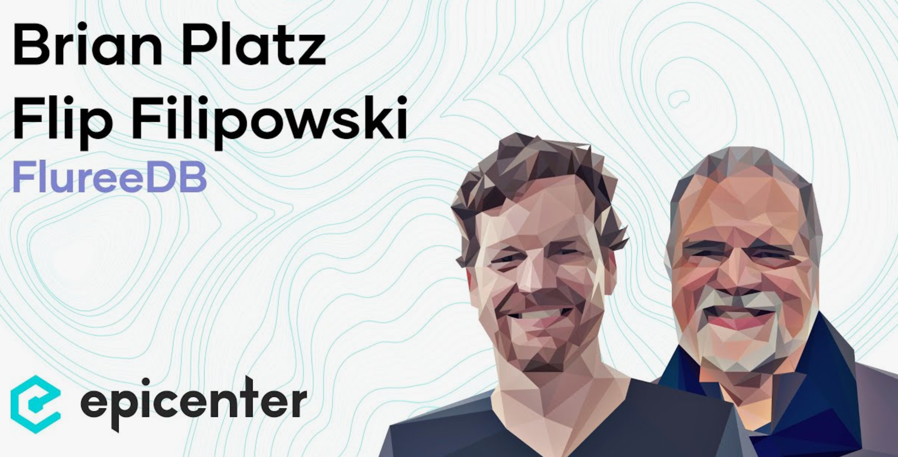

# Fluree

## a. История развития СУБД

Fluree is a blockchain-based database management system that combines functionalities of traditional databases with blockchain principles for better security, data integrity, and sharing. It was founded by Brian Platz and Flip Filipowski in 2016. Platz had worked on various web-based product initiatives, including co-founding the successful company SilkRoad technology. Filipowski has an extensive software background including founding and leading technology companies like Platinum Technology and Divine Inc. 

Fluree was developed with the capabilities of supporting ACID (Atomicity, Consistency, Isolation, Durability) transactions, ledger-based tracking of changes through blockchain, and a novel approach to data security and trust. One of its core distinguishing features is the ability to enforce data compliance, security, and privacy using Fluree SmartFunctions, which are point-in-time computations validated by the consensus of network participants. The promise of Fluree is in its ability to provide a decentralized platform where data manipulation entails executing secure, verifiable transactions. Its architecture enables creating a valid, enforceable record of all activities pertinent to the dataset it manages. The versatile capabilities of Fluree have found use across various industries including supply chain, identity management, health records, real estate, and more. Companies and systems that require an immutable data source with built-in trust mechanisms are ideal candidates for incorporating Fluree. As a result, from its conceptualization and development stages to deployment and practical applications, Fluree represents a significant evolution in how data could be stored, retrieved, and trusted on a digital platform. However, while it promises revolutionary shifts in database technology and digital trust, the adoption and evolution of such technologies inherently depend on broader market understanding, acceptance, and the ever-evolving landscape of cybersecurity and database technology.

More details in Forbs articles: [https://councils.forbes.com/profile/Brian-Platz--Co-founder-co-CEO-Fluree/bda5f5e3-b6b8-4dec-bb2f-2e032c9e3f71#company-details](https://councils.forbes.com/profile/Brian-Platz--Co-founder-co-CEO-Fluree/bda5f5e3-b6b8-4dec-bb2f-2e032c9e3f71#company-details)

1. Provides a mechanism to detect if the data has ever been changed, monitoring history of any piece of information

2. Base key that stands for the ability of data to defend itself, the permissions and roles are specified by the core not by the consumer applications

3. Fluree allows to distribute transactions validation responsibilities across different parties, multiple organizations can join a single database, none of them control the data or have exclusive permissions

__These technology allows to bring together informaion without having to dump it all into a data warehouse. It allows to issue queries across multiple data sources simultaneously it though they are the same database__

Time travel is both about keeping the whole log of changes for every piece of information. And also about allowing indexes for fast queries.

Threr is also ability to take this chain ledger platform and start to distribute the transactional consensus around it.
Two protocols are currently available
1. Raft [https://raft.github.io/](https://raft.github.io/)

2. PBFT [https://pmg.csail.mit.edu/papers/vr-to-bft.pdf](https://pmg.csail.mit.edu/papers/vr-to-bft.pdf)

##### How the transactions actually work

First thing is that every transaction requires a signature. The signature is validated, to check with in who it comes from, it's an authorized user within the system. Validate the changes against the schema of the system, make sure that it adheres to data schema. Then after validation it starts introducing smart function capability and through smart function there are very granular really custom logic to not only describe the exact shape characteristics the data must have to be acceptable but also permissions.

##### More about data storing

Fluree database supports RDF format, allowing it to manage data in a graph structure. RDF is a standard model for data interchange on the web, and it facilitates data integration among different sources. Fluree leverages RDF to enable a rich, structured approach to describing and querying data, which is particularly useful in scenarios involving complex relationships and linked data.

1. Structured Data: RDF allows data to be described in terms of subjects, predicates, and objects, which naturally fits into a graph data model. Fluree except standart triples store data in two tripls: Subjects, Predicate, Object, Tx/Time, Add/Retract, Metadata

2. Interoperability: By adopting RDF, Fluree ensures that its data is compatible with other web standards and can be easily integrated with other systems and tools that understand RDF. This interoperability is crucial for applications that need to interact with multiple databases or data sources across different platforms.

3. Semantic Queries: Fluree supports SPARQL, a powerful query language designed for RDF data, which enables users to perform complex queries across structured data. SPARQL allows users to extract meaningful relationships and data patterns that are difficult to achieve with traditional relational databases.

4. Decentralization and Integrity: Fluree combines RDF with blockchain technology, offering a unique approach to data management where data integrity and provenance are critical. The blockchain layer ensures that all data transactions are immutable and verifiable, which is advantageous in scenarios like supply chain management or regulatory compliance.

5. Schema Flexibility: RDF in Fluree supports schema-on-read capabilities, meaning that the schema or structure of data can be defined dynamically when data is read. This flexibility allows developers to adapt their data models to evolving requirements without needing to modify the underlying database schema extensively.

6. Linking Data: One of RDF’s strengths is its ability to link data from various sources using URIs (Uniform Resource Identifiers). Fluree leverages this to create a connected data environment where relationships between data points are first-class citizens, making it well-suited for applications in knowledge management, AI, and complex system integrations.

## b. Инструменты для взаимодействия с СУБД

There is a variety of different tools, methods, ways to use and interact with Fluree

1. __Fluree JS Library__ - for developores who are familiar with javascript. It is very comfortable for building browser application using Node.js and Fluree's JS Library.

2. __SPARQL__ - one of the key features of Fluree is RDF format support wchich allows to write SPARQL semantic queries.

3. __GRAPHQL__ - Fluree is graph-based and database and due to GraphQL queries working with data stored in graph structre makes life easier.

4. __Terminal utility__ - there is a command line interface which can be used for everything like starting a server, creating databases, loading data. It can be used for automation and developing scriptable operations.

5. __Fluree Admin UI__ - Fluree comes with an administrative user interface that allows to manage databases, execute queries, manage blockchain networks, and analyze the structure and contents of the database.

6. __FlureeQL__ - Fluree also supports its own query language, which is JSON-based and designed to interact more directly with the database’s graph structure and ledger capabilities.

7. __Other tools__ - as Fluree is blockchain-enhanced different tools for blockchain analysis can be used. Also Fluree supports different data visualisation tools. Different SDK's can be found on github pages

## c. Какой database engine используется в СУБД

Fluree uses a custom database engine designed specifically by their team to integrate blockchain technologies with common database features. From common DB features Fluree has ones associated with graph databases and triplestores for supporting RDF data. The combination of these methods enables Fluree to offer distinct cool features such as immutability, unchanged history tracking, and complex query capabilities using SPARQL or GRAPHQL.

1. __Blockchain Layer__: provides basic blockchain features such as:
   - Immutability and Security - Every transaction is recorded as a block in a blockchain, ensuring that data cannot be altered once written. It provieds data integrity and the history of changes.
   - Smart Functions - Fluree supports transaction logic on the blockchain, similar to smart contracts on other blockchain systems like Etherium. This allows for enforced business rules and logic at the database level which is very important for web3.
   - Data Consensus Protocol - can operate in a distributed manner over multiple servers, using consensus algorithms to ensure that each node agrees on the state of the database. This is essential for maintaining data consistency across a distributed system.

2. __Graph Database Capabilities__: provides basic database features such as:
    - Storage of RDF Data - Fluree stores data in the form similart to RDF discussed previously, aligning with the RDF standard. This structure is inherently advantageous for representing complex, interconnected data relationships.
    - Querying by SPARQL - Leveraging its RDF storage capabilities, supports SPARQL queries that enable users to explore and utilize the graph data structure effectively.

## d. Как устроен язык запросов в СУБД? Разверните БД с данными и выполните ряд запросов

As already mentioned Fluree support SPARQL, GRAPHQL and FLUREEQL. Their local DB installation also provides an userfriendly interface for making queries. Also we can use JavaScript library to write some queries. There is a bunch of different methods lets look at one of them.

To test queries to Fluree you firstly need to download and istall local server form their official documentation [https://developers.flur.ee/docs/learn/tutorial/introduction/](https://developers.flur.ee/docs/learn/tutorial/introduction/)

Then you can otherwise use postman or you browser to run some queries

After downloading we can run local fluree db from our terminal if we of course have already installed docker

Use this command

`docker run -p localhost:8080 -v `pwd`/data:/opt/fluree-server/data fluree/server:9079322dff5e32d120d1381a4279f7fcbf21176d`

Than we can use browser to make FlureeQL queries in their interface.

Make request with SPARQL

## e. Распределение файлов БД по разным носителям

Fluree is storing graph structred data on blockchain for managing distributed data. So on each node of the network we have the copy of the distributed ledger which provides securtiy, data integrity, changes history, consistency and other features common for distributed ledger technologies

## f. На каком языке/ах программирования написана СУБД

In order to answer this question we just need to open their github page as the FLuree DB is an opensource project. The core engine, the DB, the supported consensus algorithms, and supported querry languages codebase is dominantly developed using __Clojure__.

Clojure is a dynamic, general-purpose programming language, combining the approachability and interactive development of a scripting language with an efficient and robust infrastructure for multithreaded programming. Clojure is a compiled language, yet remains completely dynamic – every feature supported by Clojure is supported at runtime. Clojure provides easy access to the Java frameworks, with optional type hints and type inference, to ensure that calls to Java can avoid reflection. Clojure is a dialect of Lisp, and shares with Lisp the code-as-data philosophy and a powerful macro system. Clojure is predominantly a functional programming language, and features a rich set of immutable, persistent data structures. When mutable state is needed, Clojure offers a software transactional memory system and reactive Agent system that ensure clean, correct, multithreaded designs.

[https://clojure.org/about/rationale](https://clojure.org/about/rationale)

## g. Какие типы индексов поддерживаются в БД? Привести пример создания индексов

Fluree DB supports a range of indexing strategies designed to optimize query performance and transaction processing. These indexes are crucial, particularly because Fluree combines the features of a traditional database with blockchain technologies.

Types of Indexes in Fluree
1. Predicate Indexes
   - Purpose - Quickly access edges in the graph database, efficiently filtering based on relationships.
   - Example Usage - When you have frequent queries filtering based on specific relationships, such as finding all transactions created by a particular user.

2. Full-text Search Indexes
   - Purpose - Allow for efficient text searching across specified fields using natural language processing techniques.
   - Example Usage - Searching descriptions, comments, or any large text fields for keywords or phrases.

3. Value Indexes
   - Purpose - Index specific data values for a subject within the database, useful for both quick lookups and sorting operations.
   - Example Usage - Any query operation that requires sorting results based on a specific property (e.g., price, date).

## h. Как строится процесс выполнения запросов в СУБД

Firstly database checks the signature with which the transaction was encrypted. The signature is validated, to check with in who it comes from, it's an authorized user within the system. Than the DB validates the changes against the schema of the system, make sure that it adheres to data schema. Then after validation it starts introducing smart function capability. If we talk about queries it uses its custom "SmartQuery" engine that interprets and optimizes queries. This engine is designed to analyze the query structure and devise the most efficient execution plan. The engine decides the best way to retrieve and aggregate the data, whether the data is stored on a single node or across multiple nodes in a distributed system.

## i. Есть ли для СУБД понятие «план запросов»? Если да, объяснить, как работает данный этап

This is not a good answer but all I found is a paper about evaluating queries for graph-structred databases here [https://ceur-ws.org/Vol-1644/paper38.pdf](https://ceur-ws.org/Vol-1644/paper38.pdf)

## j. Поддерживаются ли транзакции в СУБД? Если да, то рассказать о нем. Если нет, то существует ли альтернатива

Fluree is a blockchain-enhanced database and it of course supports transactions. It even supports smart functions which allow developers to write transactions similart to smart contracts on othe blockchain netwroks. It also support distributed consensus algorith. Raft and PBFT are already implemented in their project and they can be configured specially for unique organization which is going to use the DataBase.

## k. Какие методы восстановления поддерживаются в вашей СУБД. Расскажите о них.

Fluree is Blockchain designed and supports distributed ledger technologies. So if we have enough nodes in our network we can easiely recover data on one node just copying tham form another participant node. This approach provides security, integrity, also the ability to time travel to any state of the database at any timepoint.

## l. Расскажите про шардинг в вашей конкретной СУБД. Какие типы используются? Принцип работы

Fluree does not inherently support sharding in the common sense that databases like MongoDB might implement, where data is automatically partitioned across different servers. Fluree is built on blockchain principles, which typically involve each node in a network holding a complete copy of the ledger. This design provides security and data integrity but differs from the classical sharding approach where data is divided to scale out the database.

## m. Возможно ли применить термины Data Mining, Data Warehousing и OLAP в вашей СУБД

The first words of Brian Platz on introduction presentation were about that the world is developing in way that in web-3 projects we do not want any Data-Warehousing for our applications and systems [https://www.youtube.com/watch?v=uSum3uynHy4](https://www.youtube.com/watch?v=uSum3uynHy4) and Fluree is not about Data-Warehousing. Also usually data warehousing expects that we have enormous amount of data which cannot be stored on only one existing machine. Fluree uses blockchain and we cannot store different data on different nodes of one network. We will need two networks.

For data mining we can use tools taht allow to analysie blochchains. All such tools can be used with Fluree.

## n. Какие методы защиты поддерживаются вашей СУБД? Шифрование трафика, модели авторизации

As Fluree uses blockchain for keeping distributed ledger we have here all security layers that provides blcokchain technologies. For authentication it uses validation of signatures for each participant of the network.

## o. Какие сообщества развивают данную СУБД? Кто в проекте имеет права на коммит и создание дистрибутива версий? Расскажите об этих людей и/или компаниях

There are 7 main contributors which are developing the core engine and accpeting pull requests to the project's main branch

1. Ben Lamothe - New York - [https://github.com/zonotope](https://github.com/zonotope)

2. Wes Morgan - Denver - [https://github.com/cap10morgan](https://github.com/cap10morgan)

3. Daniel Petranek - New York - [https://github.com/dpetran](https://github.com/dpetran)

4. Brian Platz - New York - [https://github.com/bplatz](https://github.com/bplatz)

5. Marcela Poffald - Denver - [https://github.com/mpoffald](https://github.com/mpoffald)

6. Daniel Higginbotham - Denver - [https://github.com/flyingmachine](https://github.com/flyingmachine)

7. Andrew A. Johnson - New York - [https://github.com/aaj3f](https://github.com/aaj3f)

They also have a team for managing their website and media. Two offices in Denver and NewYork

## p. Создайте свои собственные данные для демонстрации работы СУБД

## q. Как продолжить самостоятельное изучение языка запросов с помощью демобазы

- Fluree has its own QueryLanguage FLureeQL, to work with it we can use their official documentation [https://developers.flur.ee/docs/nexus/datasets/notebooks/#flureeql](https://developers.flur.ee/docs/nexus/datasets/notebooks/#flureeql)

- Fluree supports SPARQL so we can just learn it on their official documentation page [https://www.w3.org/TR/sparql11-query/](https://www.w3.org/TR/sparql11-query/) whic will be useful even if you don't plan to wrok with Fluree

- Fluree support GRAPHQL so we can jsut learn it on their official documentation page [https://graphql.org/learn/](https://graphql.org/learn/) which will be useful even if you don't plan to work with Fluree

## r. Где найти документацию и пройти обучение

We can just open their github page and use the step-by-step guide [https://github.com/fluree/db](https://github.com/fluree/db)

Also they have an official documentation on their official website [https://developers.flur.ee/](https://developers.flur.ee/)

## s. Как быть в курсе происходящего

To keep up to date with events and news:

- 1. Subscribe to their channel on YouTube - [https://www.youtube.com/@Fluree](https://www.youtube.com/@Fluree)

- 2. Read news on their website - [https://flur.ee/resources/news/](https://flur.ee/resources/news/)

- 3. Read blogs on their website - [https://flur.ee/fluree-blog/](https://flur.ee/fluree-blog/)

- 4. Follow Fluree on linkedin [https://www.linkedin.com/company/fluree-pbc/](https://www.linkedin.com/company/fluree-pbc/)

- 5. Follow Fluree on twitter(X) [https://twitter.com/FlureePBC](https://twitter.com/FlureePBC)

- 6. Subscribe and follow their github project [https://github.com/fluree](https://github.com/fluree)

- 7. Follow Fluree on discord - [https://launchpass.com/flureedb](https://launchpass.com/flureedb)

---
